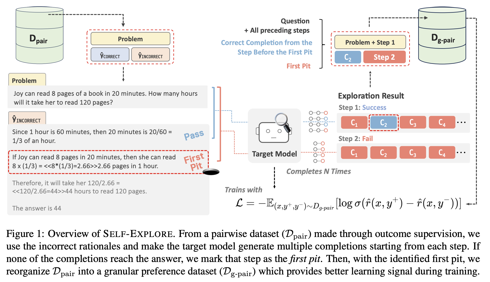
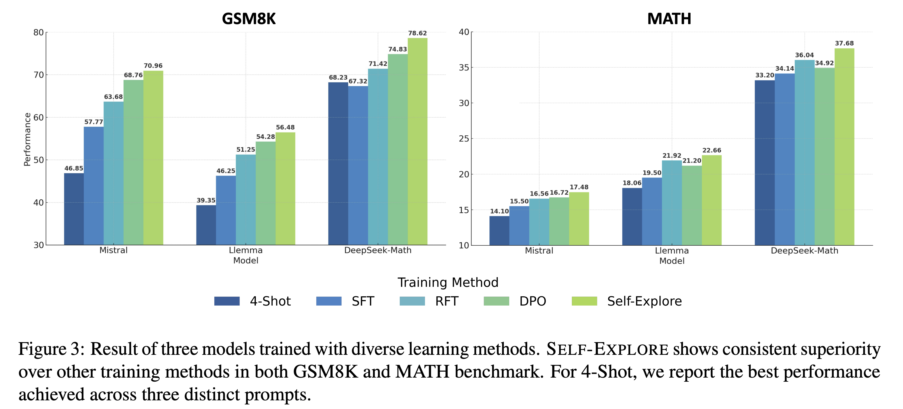

# Self-Explore
#### Self-Explore to avoid ️the p️️it! <br /> Improving the Reasoning Capabilities of Language Models with Fine-grained Rewards
---
This is the official github repository for <ins>**Self-Explore**</ins>. <br /> <br />
Paper Link: https://arxiv.org/abs/2404.10346

## Overview:


## Setting

Run ``pip install -r requirements.txt`` <br />
All experiments were carried out using 4 x NVIDIA A100 80GB, with CUDA version 12.0.


## Data

In the data directory, you will find the train and test file for `GSM8K` and `MATH`.

## Training

> #### Stage 1. Run SFT:
Run **SFT** (or FT, in short) to get the base generator.  <br />
In `/scripts/{task}/sft/run_ft.sh` you'll see the script necessary for this. (For data_path, please put the trian file.) <br />
Put necessary paths to the files and models then simply run `sh scripts/{task}/sft/run_ft.sh` in the main directory.

> #### Stage 2. Get RFT Data:
Now you'll need to generate *N* instances per problem.  <br />
To do this, go to `gen` directory and run `sh gen_rft_data.sh`.  <br />
This assumes you are using 4 GPUs, and generates the predictions in parallel using each GPU. <br />
Once completed, you will see **RFT** and **DPO** training file.

> #### Stage 3. Run RFT:
Run **RFT** to get the RFT model, which acts our explorer and reference model when training for DPO. <br />
in `/scripts/{task}/sft/run_rft.sh` you'll see the script necessary for this. <br />
Put necessary paths to the files and models then simply run `sh /scripts/{task}/sft/run_rft.sh` in the main directory.

> #### Stage 4. 🔎 Explore :
To find the first ***pit***, let the RFT model explore from each step within rejected sample. <br />
You can do this by running `gen_step_explore.sh` in `gen` directory. (For data_path here, please put the DPO file generated). <br />
Then you will get a file named ending in `gpair_{k}.jsonl` <br />
which is your fine-grained pairwise training data.

> #### Stage 5. Train with Preference Learning Objective:
You can apply any arbitrary preference learning objective, but in our work, we chose **DPO (Direct Preference Optimization)**. <br />
To do this refer to `scripts/{task}/dpo/run_dpo.sh`. 
- To run with the outcome-supervision labels, set the training data as the DPO file generated in Stage 3.
- To run with the step-level fine-grained labels (ours), set the training data as the gpair file generated in Stage 4.

## Evaluation

Under `eval/{task}` directory, you'll find the script needed for running evaluation.

## Results


## Models
We release our best trained DeepSeek-Math's **GSM8K** and **MATH** trained checkpoints on huggingface.
| Model                    | Accuracy |                           Download                           |
| :----------------------- | :-------------: | :----------------------------------------------------------: |
|**DeepSeek_Math_Self_Explore_GSM8K** | 78.62      | 🤗 [HuggingFace](https://huggingface.co/hbin0701/DeepSeek_MATH_Self_Explore) |
|**DeepSeek_Math_Self_Explore_MATH** |      37.68      | 🤗 [HuggingFace](https://huggingface.co/hbin0701/DeepSeek_GSM8K_Self_Exploret) |

## Acknowledgemenets
Our evaluation codes are borrowed from: <br />
- GSM8K: [OVM](https://github.com/FreedomIntelligence/OVM) <br />
- MATH: [DeepSeek-Math](https://github.com/deepseek-ai/DeepSeek-Math) 

## Citation
```
@misc{hwang2024selfexplore,
      title={Self-Explore to Avoid the Pit: Improving the Reasoning Capabilities of Language Models with Fine-grained Rewards}, 
      author={Hyeonbin Hwang and Doyoung Kim and Seungone Kim and Seonghyeon Ye and Minjoon Seo},
      year={2024},
      eprint={2404.10346},
      archivePrefix={arXiv},
      primaryClass={cs.CL}
}
```
